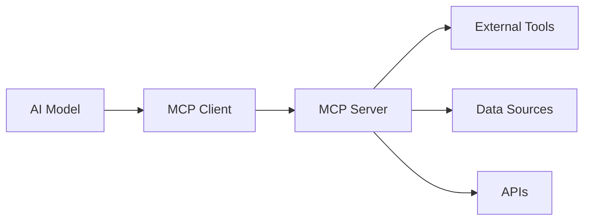

**Model Context Protocol (MCP)** represents a paradigm shift in how AI systems interact with external tools and maintain context. As an open-source standard, MCP is transforming the landscape of AI development and integration.

## What is Model Context Protocol?

MCP is a **standardized communication protocol** that enables AI models to:
- **Seamlessly integrate** with external tools and services
- **Maintain context** across multiple interactions
- **Access real-time data** from various sources
- **Execute complex workflows** with proper state management

### Core Components of MCP

```typescript
interface MCPServer {
  name: string;
  version: string;
  tools: Tool[];
  resources: Resource[];
  prompts: Prompt[];
}
```

## Key Features and Benefits

### 1. Unified Tool Integration
- **Standardized API** for tool communication
- **Type-safe interactions** between AI and external services
- **Automatic tool discovery** and capability negotiation

### 2. Enhanced Context Management
- **Persistent state** across conversation sessions
- **Structured memory** for complex workflows
- **Context-aware tool execution**

### 3. Real-time Data Access
- **Live API integrations** for current information
- **Database connectivity** for enterprise systems
- **File system access** with proper permissions

## MCP in Action: Practical Applications

### Business Intelligence Integration
```python
# Example: MCP-enabled BI data access
@mcp_tool
def get_sales_metrics(period: str, region: str):
    """Fetch real-time sales data with MCP protocol"""
    return {
        "revenue": query_database(period, region),
        "context": "Q4 2024 performance analysis"
    }
```

### Data Analytics Workflows
- **Automated report generation** with live data
- **Interactive dashboard updates** through MCP tools
- **Cross-platform data synchronization**

### Development Automation
- **Code analysis and refactoring** with contextual understanding
- **Documentation generation** based on codebase state
- **Testing automation** with intelligent test case generation

## MCP Architecture Patterns

### Client-Server Model


### Resource Management
- **Tool Discovery** - Automatic capability detection
- **Permission Control** - Granular access management
- **Error Handling** - Robust failure recovery

## Implementation Best Practices

### 1. Security Considerations
- **Authentication** and authorization protocols
- **Data encryption** for sensitive information
- **Access control** based on user permissions

### 2. Performance Optimization
- **Connection pooling** for database access
- **Caching strategies** for frequently accessed data
- **Async operations** for non-blocking tool execution

### 3. Error Handling
```typescript
try {
  const result = await mcpTool.execute(params);
  return processResult(result);
} catch (error) {
  return handleMCPError(error);
}
```

## Industry Impact and Use Cases

### Enterprise Integration
- **CRM systems** integration for customer data
- **ERP connectivity** for business process automation
- **Analytics platforms** for real-time insights

### Developer Productivity
- **IDE integration** for intelligent code assistance
- **CI/CD pipeline** automation with context awareness
- **Documentation** and knowledge management

### Data Science and Analytics
- **Automated model training** with live data feeds
- **Real-time prediction** serving with MCP tools
- **Experiment tracking** and result analysis

## Getting Started with MCP

### Development Environment Setup
1. **Install MCP SDK** for your preferred language
2. **Configure tool servers** for your specific needs
3. **Implement authentication** and security measures
4. **Test integration** with sample workflows

### Common Integration Patterns
- **Database connections** for data access
- **API wrappers** for external services
- **File system tools** for document processing
- **Monitoring tools** for system health

## The Future of MCP

Emerging trends in MCP development:
- **Multi-modal integrations** combining text, voice, and visual data
- **Federated tool networks** for distributed AI systems
- **Advanced context preservation** across complex workflows
- **AI-driven tool composition** for dynamic workflow creation

## Conclusion

Model Context Protocol is more than just a technical specification—it's the foundation for the next generation of AI-powered applications. By standardizing how AI systems interact with tools and maintain context, MCP enables developers to build more sophisticated, reliable, and powerful AI solutions.

As the protocol continues to evolve, we can expect to see even more innovative applications that leverage the full potential of contextual AI interactions. The future of AI development is here, and it's built on the solid foundation of MCP. 