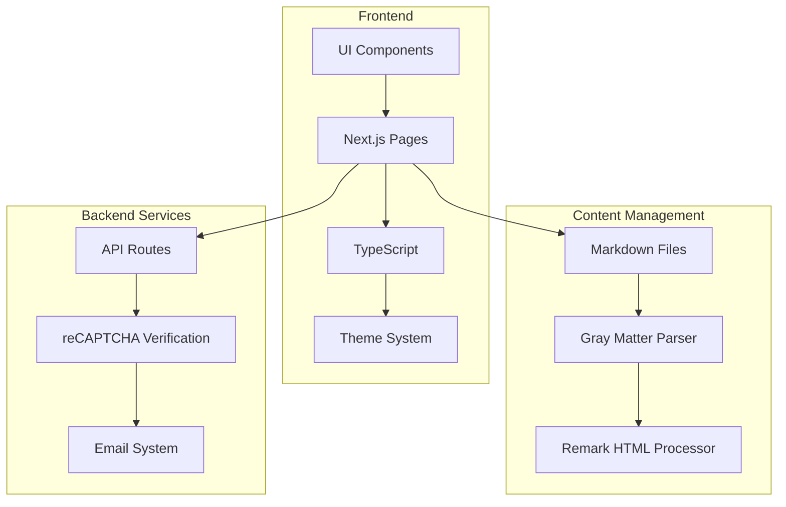
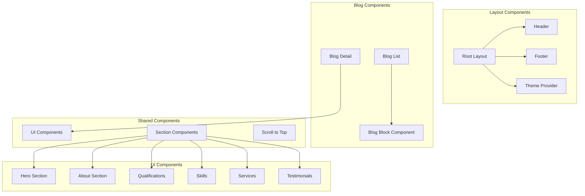
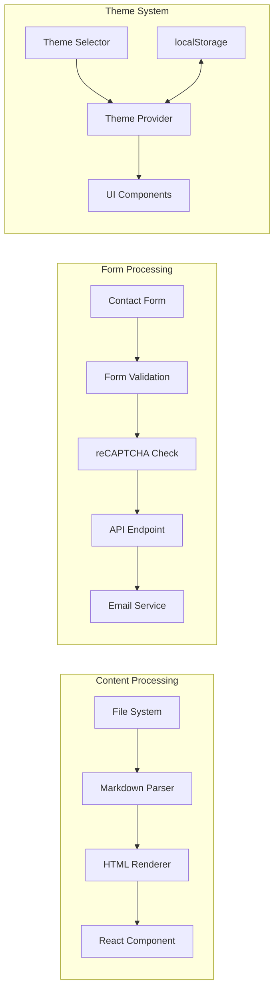
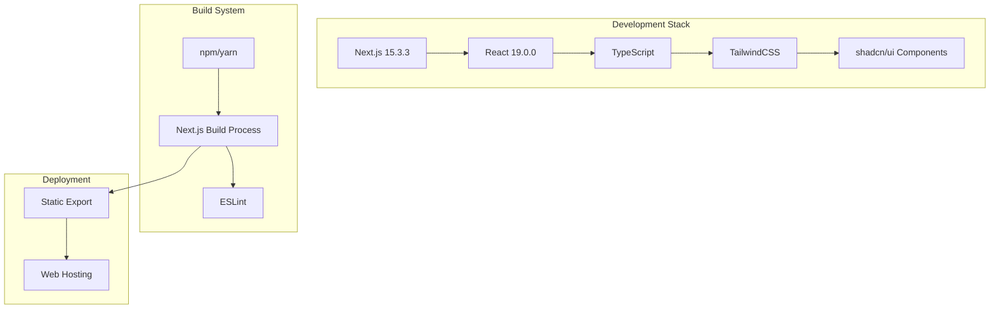

# System Architecture Diagrams

@context7:ARCH

## Overall System Architecture

```mermaid
graph TD
    subgraph "Frontend"
        UI["UI Components"]
        Pages["Next.js Pages"]
        TS["TypeScript"]
        themes["Theme System"]  
    end

    subgraph "Content Management"
        markdown["Markdown Files"]
        matter["Gray Matter Parser"]
        remark["Remark HTML Processor"]
    end

    subgraph "Backend Services"
        api["API Routes"]
        email["Email System"]
        recaptcha["reCAPTCHA Verification"]
    end

    UI --> Pages
    Pages --> TS
    TS --> themes
    
    Pages --> markdown
    markdown --> matter
    matter --> remark
    
    Pages --> api
    api --> recaptcha
    recaptcha --> email
```

## Component Structure

```mermaid
graph TD
    subgraph "Layout Components"
        layout["Root Layout"]
        header["Header"]
        footer["Footer"]
        theme["Theme Provider"]
    end

    subgraph "UI Components"
        hero["Hero Section"]
        about["About Section"]
        qualifications["Qualifications"]
        skills["Skills"]
        services["Services"]
        testimonials["Testimonials"]
    end

    subgraph "Blog Components"
        blogList["Blog List"]
        blogDetail["Blog Detail"]
        blogBlock["Blog Block Component"]        
    end

    subgraph "Shared Components"
        ui["UI Components"]
        section["Section Components"]
        scroll["Scroll to Top"]
    end

    layout --> header
    layout --> footer
    layout --> theme
    
    section --> hero
    section --> about
    section --> qualifications
    section --> skills
    section --> services
    section --> testimonials
    
    blogList --> blogBlock
    blogDetail --> ui
```

## Data Flow Diagram

```mermaid
graph LR
    subgraph "Content Processing"
        fs["File System"] --> parser["Markdown Parser"]
        parser --> renderer["HTML Renderer"]
        renderer --> component["React Component"]
    end

    subgraph "Form Processing"
        form["Contact Form"] --> validation["Form Validation"]
        validation --> recaptcha["reCAPTCHA Check"]
        recaptcha --> api["API Endpoint"]
        api --> email["Email Service"]
    end

    subgraph "Theme System"
        themeSelector["Theme Selector"] --> themeProvider["Theme Provider"]
        themeProvider --> components["UI Components"]
        localStorage["localStorage"] <--> themeProvider
    end
```

## Development Environment

```mermaid
graph TD
    subgraph "Development Stack"
        next["Next.js 15.3.3"]
        react["React 19.0.0"]
        ts["TypeScript"]
        tailwind["TailwindCSS"]
        shadcn["shadcn/ui Components"]
    end

    subgraph "Build System"
        npm["npm/yarn"]
        nextBuild["Next.js Build Process"]
        eslint["ESLint"]        
    end

    subgraph "Deployment"
        static["Static Export"]
        hosting["Web Hosting"]
    end

    next --> react
    react --> ts
    ts --> tailwind
    tailwind --> shadcn
    
    npm --> nextBuild
    nextBuild --> eslint
    nextBuild --> static
    static --> hosting
```
